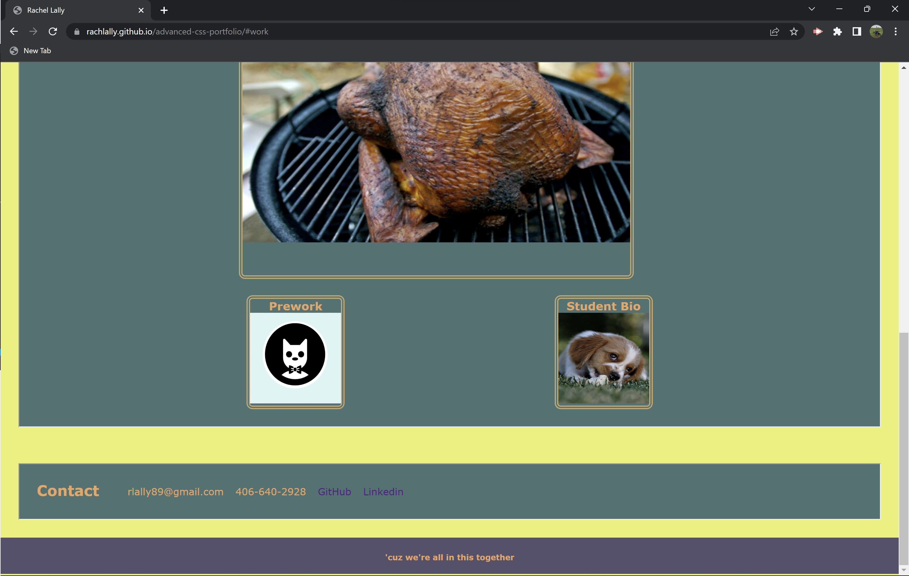

# Advanced CSS Portfolio
A portfolio of work samples

## Description

This is a portfolio of work samples created by Rachel Lally (me!).  In entering this industry, it will be expected that I can supply a portfolio of work samples so employers can better gage my abilities and skillset.  While this page is still in its early stages, I think it is important I begin this process now.  Prior to this project, I did not have an outline for how to present work I have started and completed.  While the projects I included in this sample are still under construction, I now have a place to post once completed.  

I learned more about CSS through this exercise.  In particular, I focused on flexboxes and how they asssit in the alignment of a page.  I utilzed some fun CSS tools like hover and transform to play around with movement.  

## Usage

The user can find the page at: https://rachlally.github.io/advanced-css-portfolio/.

This page is very user friendly.  The navigation bar located at the top-right of the page will take a user to the section they are interested in exploring.  

Once a user has navigated to the "My Work" section, they are able to click on the image of my project to link directly to that site.

Regardless of the device, the user should find a responive screen.

## License

MIT License

Copyright (c) 2022 rachlally

---
